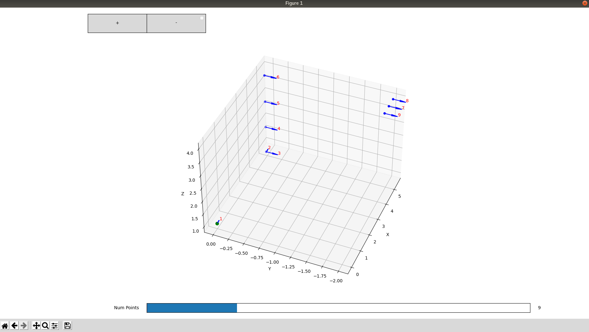

## Build

```
make
```


## Run 
```
.pyenv/bin/python ./file_visualized.py <inputFile.csv> <outputFile.csv> <missionName> <default_points_to_draw>
```
example
```
.pyenv/bin/python ./file_visualized.py test.csv testOut.csv testName 1
```


